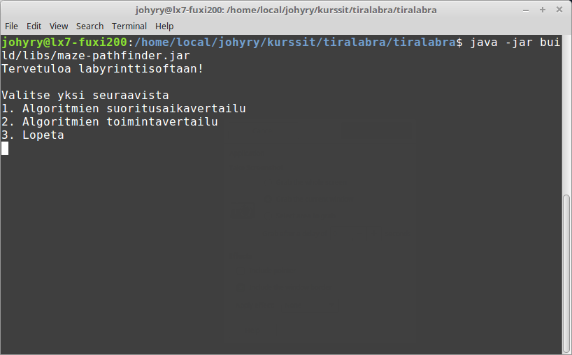
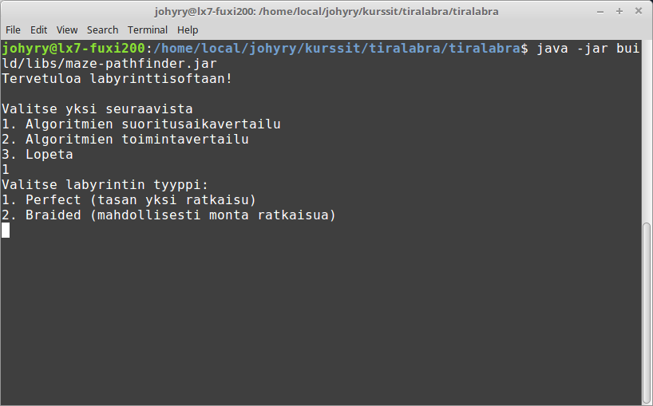
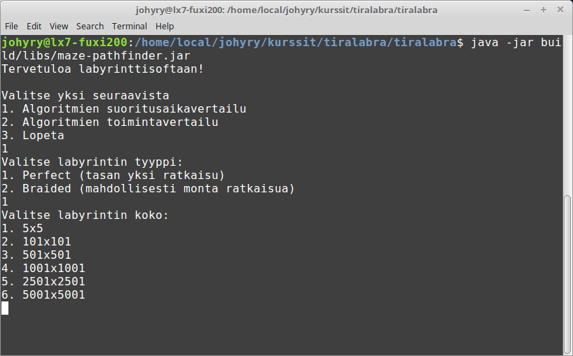
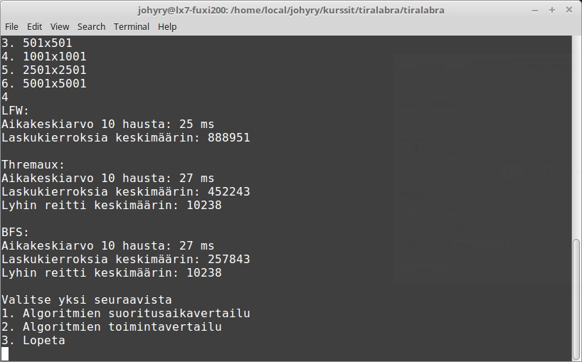
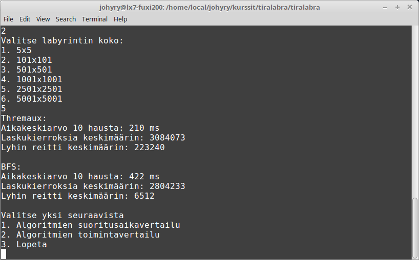
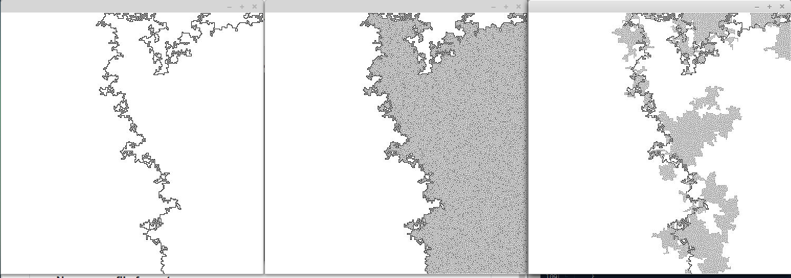

Lataa jar-tiedosto osoitteesta:
https://github.com/johyry/maze-pathfinder/releases

Kloonaa git repositorio koneellesi komennolla git@github.com:johyry/maze-pathfinder.git

Siirrä lataamasi releasesta lataamasi jar tiedosto projektin juureen (Tämä siksi, että jostain syystä pelkkä jar tiedosto ei löydä generoituja kuvia jos projekti ei ole koneellasi ja jar tiedosto samassa kansiossa)

Aja ohjelma komennolla java -jar maze-pathfinder.jar

Saavut päävalikkoon

Valinnalla
1. pääset suoritusaikavertailuun
2. toimintavertailuun
3. lopetat ohjelman

Suoritusaikavertailu:

Valinnalla
1. pääset vertailemaan algoritmeja täydellisissä labyrinteissä
2. braided labyrinteissä

Valinnalla 1-6 saat valittua haluamasi labyrintin koon

Valittuasi esim koon 1001x1001 ohjelma printtaa tulokset järjestyksessä
1. Leftwallfollower
2. Thremaux
3. Breadth-first-search
Antaen jokaisen algoritmin käytetyn aikamäärän, laskukierrokset ja löydetyn lyhimmän reitin keskimäärin 10 hausta

Valittuasi suoritusaikavertailussa braided labyrintin pääset samaan kokovalikkoon josta valittuasi koon algoritmi printtaa samat tulokset Thremauxilta ja Breadth-first-searchilta. Leftwallfollower ei toimi braided labyrinteissä.

Aloitusvalikossa valittuasi toimintavertailun, pääset valitsemaan samaan tapaan labyrintin tyypin ja koon. Riippuen siitä valitsitko täydellisen vai braided labyrintin ohjelma printtaa 2 tai 3 kuvaa algoritmin toimintaperjaatteista. Kuvissa breadth-first-search printtaa vain nopeimman reitin mustalla viivalla. Muut algoritmit printtaavat mustalla löydetyn nopeimman reitin ja harmaalla paikat missä algoritmi on käynyt.

Suljettuasi yhden kuvan ohjelma sulkeutuu.

