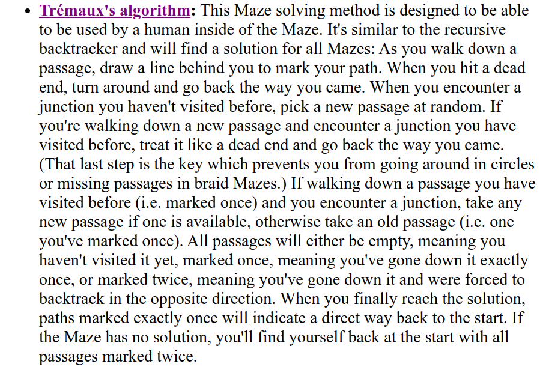

<h1> Määrittelydokumentti </h1>

Projekti toteutetaan Javalla.

<h3> Käytetyt algoritmit ja tietorakenteet </h3>

Käytän työssäni valmista labyrintti-generaattoria [Daedalusta](https://www.astrolog.org/labyrnth/daedalus.htm). Generoin ohjelmalla 2D labyrinttejä, ja koodaan erilaisia algoritmeja nopeimman reitin ratkaisemiseen. Algoritmeiksi valitsen Leveyshaun, LeftWallFollowerin ja Trémauxin algoritmin.

<h3> Mikä on ratkaistava ongelma ja miksi kyseiset tietorakenteet </h3>

Ratkaistava ongelma on reitin löytäminen labyrintissä. Leveyshaulla saa varmasti haettua nopeimman reitin. Tremauxin algoritmi toimii samaan tapaan kuin syvyyshaku. Tämä löytää täydellisissä labyrinteissä nopeimman reitin aina ja nopeammin kuin leveyshaku. Tämä on myös mielenkiintoinen siksi, että ihminen voisi käyttää tätä labyrinttia ratkaistaessaan. Kolmas algoritmi on Left Wall Follower. Tämä käytännössä toimii niin, että labyrintissä kuljetaan pitäen aina vasen käsi seinässä. Algoritmi löytää reitin ulos vain täydellisissä labyrinteissä.

Vertailumielessä mielenkiintoista on ratkaisuajat täydellisissä labyrinteissä, missä kaikki algoritmit löytävät reitin ulos, ja sitten ratkaisuajat/reitin pituus "braided" labyrinteissä, missä on useita reittejä ulos. Jälkimmäisessä tapauksessa LWF ei löydä reittiä, joten vertailuun jää kaksi ensimmäistä.

<h3> Ohjelmalle syötettävät syötteet ja niiden käyttö </h3>

Ohjelma saa syötteenä tiedostoksi (bitmapiksi) generoidun labyrintin. Tämä muutetaan sitten ohjelmassa taulukoksi ja se sitten ratkaistaan. Mahdollisesti myös piirretään uusi bitmappi missä on ratkaistu reitti.

<h3> Tavoitteena olevat aikavaativuudet ja tilavaativuudet </h3>

Leveyshaun aikavaativuus on O(V+E), missä V on solmujen määrä, ja E reunojen määrä.

Thremauxin aikavaativuus on myös O(V+E) samoilla määritelmillä.

Left wall followerin aikavaativuus on myös O(V+E).

<h3> Lähteet: </h3>

[Daedaluksen algoritmisivu] (https://www.astrolog.org/labyrnth/algrithm.htm)

[Thremaux wikipedia] (https://en.wikipedia.org/wiki/Maze_solving_algorithm#Tr%C3%A9maux's_algorithm)

[Left wall follower] (https://en.wikipedia.org/wiki/Maze_solving_algorithm#Wall_follower)

[Leveyshaku wikipedia](https://en.wikipedia.org/wiki/Breadth-first_search)
